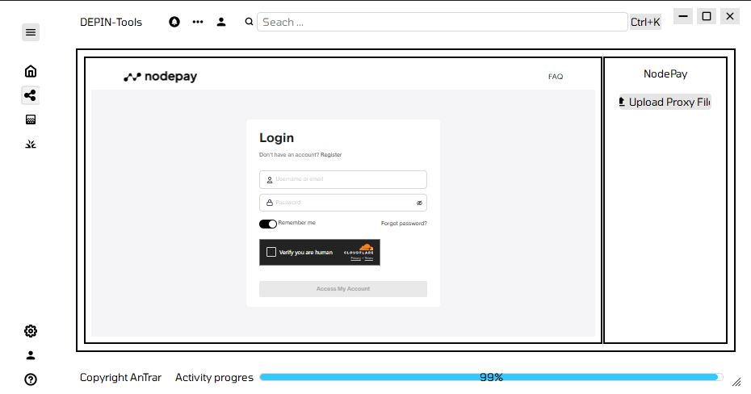
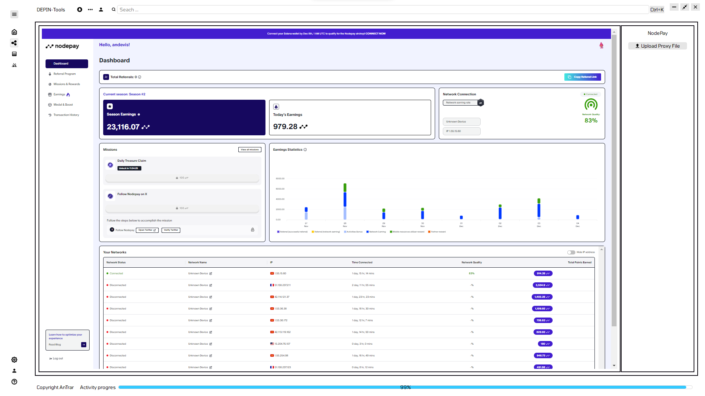

"""
# DEPIN_Tools v0.0.0.1.dev1 🚀

*Simplifying and automating DePIN networks for everyone.*

---

### **Introduction**
Welcome to **DEPIN_Tools**, the all-in-one solution for enhancing your decentralized infrastructure experience.
Our **first feature**, launching with **v0.0.0.1.dev1**, is a **cutting-edge automation tool for NodePay**, designed to streamline node deployment and management.

This release is the foundation of a broader roadmap that will empower users to efficiently manage and optimize their participation in NodePay and beyond.

**Anticipated Release Date**: **December 18, 2024** 🎉

---

### **Key Benefits**

1. **Seamless Automation**
   - Fully automate NodePay node operations, reducing manual effort and maximizing uptime.

2. **Stealth Mode Enabled**
   - Enhanced configurations to minimize detection by NodePay, ensuring your operations remain discreet.

3. **Flexible Node Management**
   - Adapt quickly to changes in network conditions with advanced, customizable settings.

4. **Future Expansion**
   - Our vision includes support for additional DePIN projects and robust automation features, making DEPIN_Tools your ultimate toolkit for decentralized networks.

---

### **Upcoming Features**

🔮 **Planned Enhancements**:
- **Multi-project support** for popular DePIN networks.
- **Advanced automation capabilities**, including task scheduling and performance analytics.
- **User-friendly dashboards** for real-time node monitoring and control.

We are committed to providing regular updates to meet the evolving demands of the DePIN ecosystem.

---

*Illustration: Simplified workflows and advanced automation for NodePay.*

---

### **How to Get Started**

1. Download the DEPIN_Tools v0.0.0.1.dev1 release on **December 18, 2024**.
2. Follow the included setup guide to configure your NodePay nodes.
3. Experience the power of automation and seamless management.

For support or inquiries, please contact us at **support@depintools.com** or join our vibrant community on Discord.

---

### **Why Choose DEPIN_Tools?**

Built by experts in Web3 and decentralized infrastructure, DEPIN_Tools aims to revolutionize the way you interact with DePIN networks.
With **automation**, **privacy**, and **flexibility** at its core, DEPIN_Tools empowers you to achieve more with less effort.

> *"Automation is the future. Simplify your journey with DEPIN_Tools."*

Stay tuned for future updates as we expand support for more DePIN projects and introduce innovative features to meet your evolving needs!
"""
